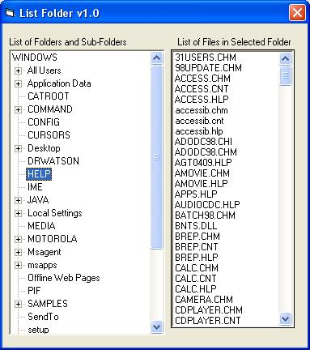



## Get a list of directories \(recursive\) in a treeview

### Description

This code generates a treeview of a specified folder and it's sub folders (recursive)
 
### More Info
 
FolderName="C:\WINDOWS" .. you can define your own folder name

One thing i am unable to do is that it does not list the directories which are hidden or system. If anybody resolves this, let me know

             |
---                |---
**Submitted On**   |2002-08-11 09:33:56
**By**             |[Yen Dutt Jain](https://github.com/Planet-Source-Code/PSCIndex/blob/master/ByAuthor/yen-dutt-jain.md)
**Level**          |Beginner
**User Rating**    |4.0 (8 globes from 2 users)
**Compatibility**  |VB 6\.0
**Category**       |[Files/ File Controls/ Input/ Output](https://github.com/Planet-Source-Code/PSCIndex/blob/master/ByCategory/files-file-controls-input-output__1-3.md)
**World**          |[Visual Basic](https://github.com/Planet-Source-Code/PSCIndex/blob/master/ByWorld/visual-basic.md)
**Archive File**   |[Get\_a\_list1167648112002\.zip](https://github.com/Planet-Source-Code/yen-dutt-jain-get-a-list-of-directories-recursive-in-a-treeview__1-37824/archive/master.zip)

